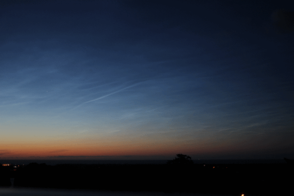

# Camera-Based-Detection-and-Localization-of-Noctilucent-Clouds

This thesis deals with the detection and localization of Noctilucent clouds (NLC). Thousands of images are analysed to understand the effects of solar position and camera settings. Based on the observation of historic image data, templates are formed, these templates are used to compare the surface similarity with the test images for detection of the Stratosphere clouds. Later Spatial Filter Velocimetry (SFV) technique is used to identify the presence of moving structures in the temporal images. By considering a threshold value for the amplitude of SFV signal NLC is segmented. 

After detecting NLC pixels, in images from two different cameras located in same observation plain distance and height to the NLC is calculated using Homogeneous co-ordinate transformations and triangulation techniques.

NLC structures

SFV Signal Amplitude

